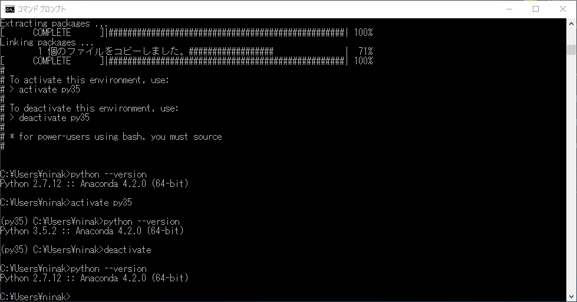

PythonからMIDIの読み書きができると聞いて触りたくなりました。
  
普段はPython3.5を使っているのですが、PythonでMidiを扱うためのライブラリ「python-midi」と「pretty_midi」がPython3に非対応のため、Python2.7とPython3.5を同居させる必要がでました。
  
PythonをWindows環境へインストールするにはAnacondaという統合パッケージが非常に優秀なのですが、果たして2.7と3.5を両方インストールして大丈夫なのでしょうか。

<!--more-->

<a href="http://www.geocities.jp/penguinitis2002/computer/programming/Python/Anaconda_Python2_3.html" target="_blank">Anaconda における Python 2 と Python 3 の共存</a>

Windows10をクリーンインストールしたばっかりだったので、Anaconda2.7をインストール後、上記URLを参考に

<pre class="brush: plain; title: ; notranslate" title="">conda create -n py35 python=3.5 anaconda</pre>

<pre class="brush: plain; title: ; notranslate" title="">activade py35</pre>

および

<pre class="brush: plain; title: ; notranslate" title="">deactivade</pre>

で簡単に環境切り替えができるようになりました！
  
感謝！