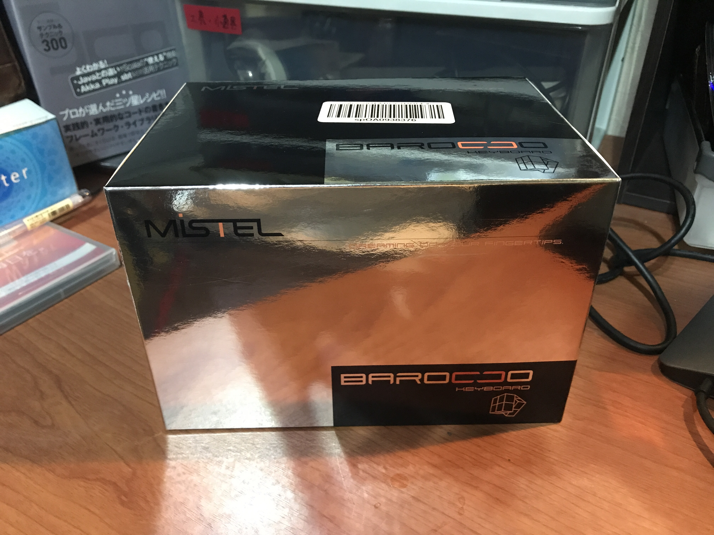
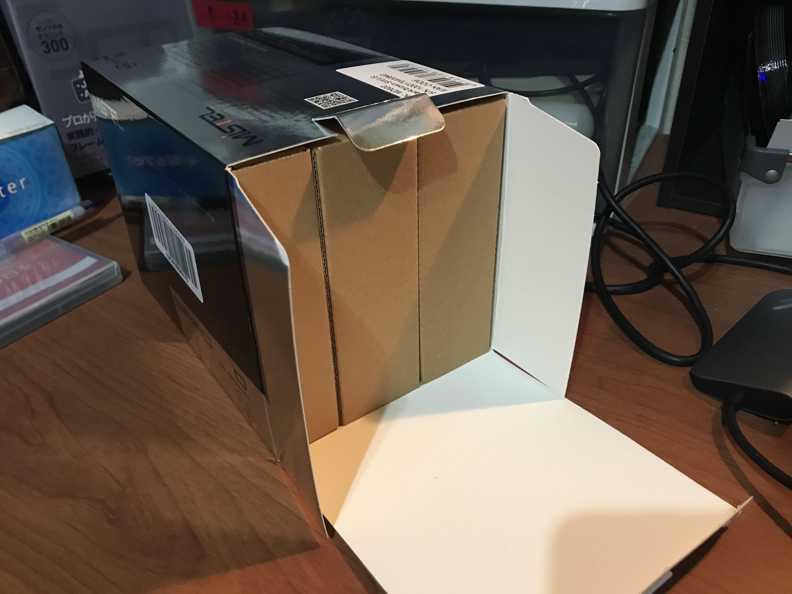
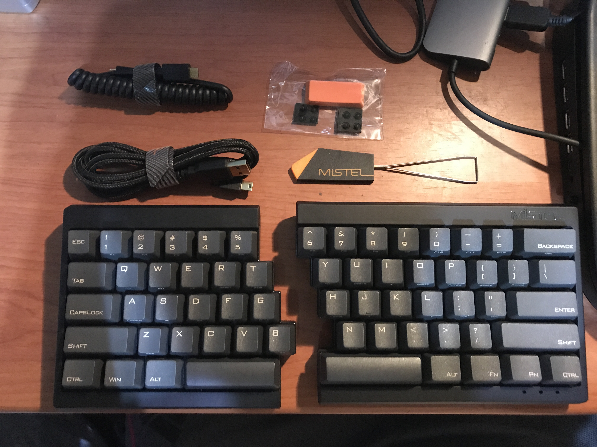
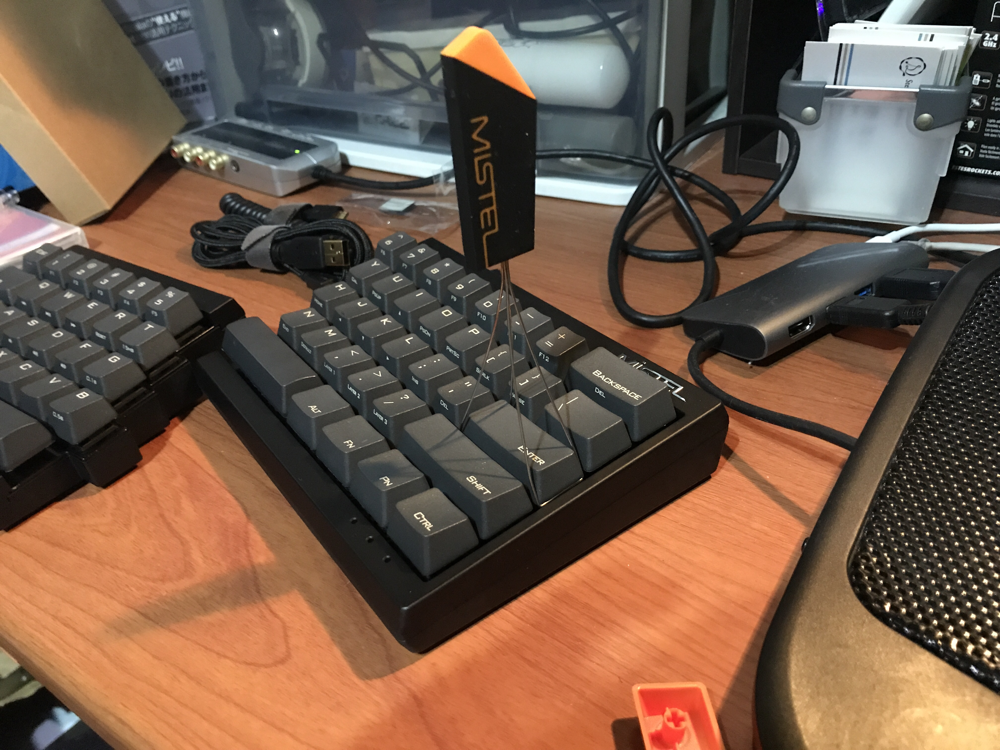
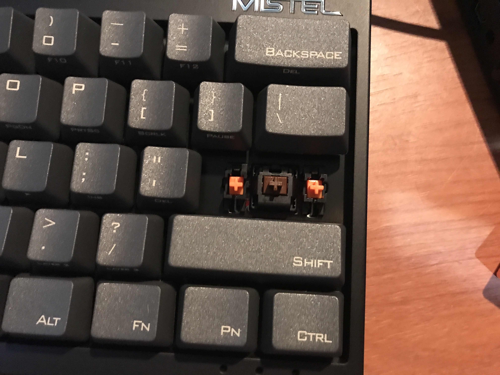
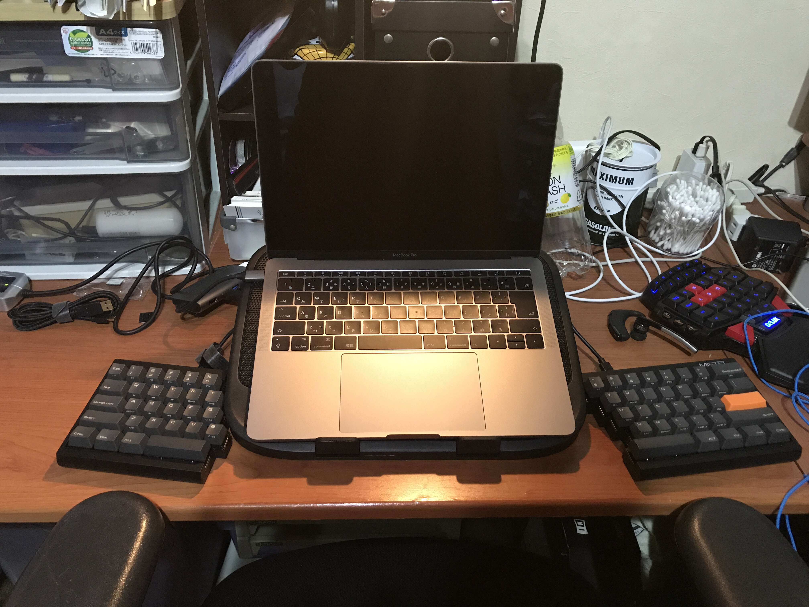
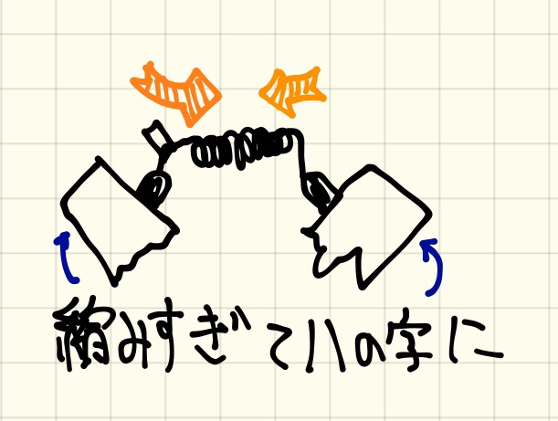
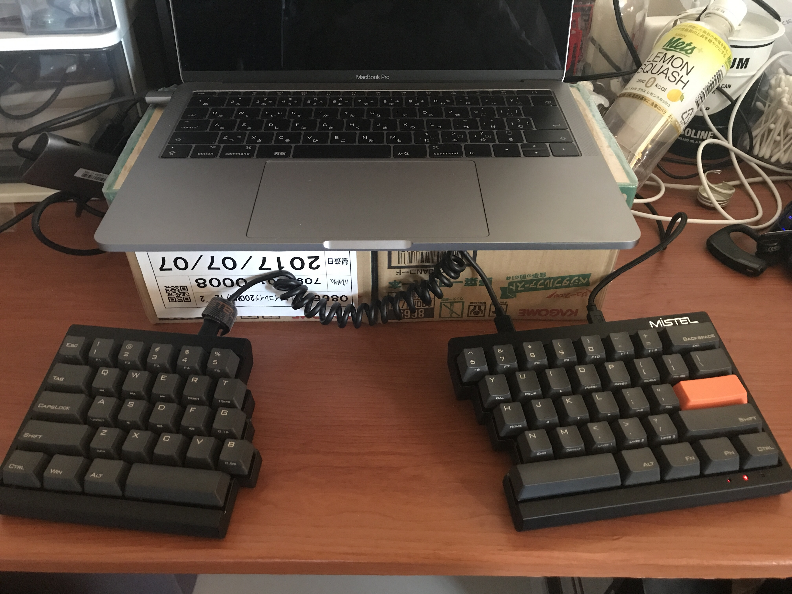
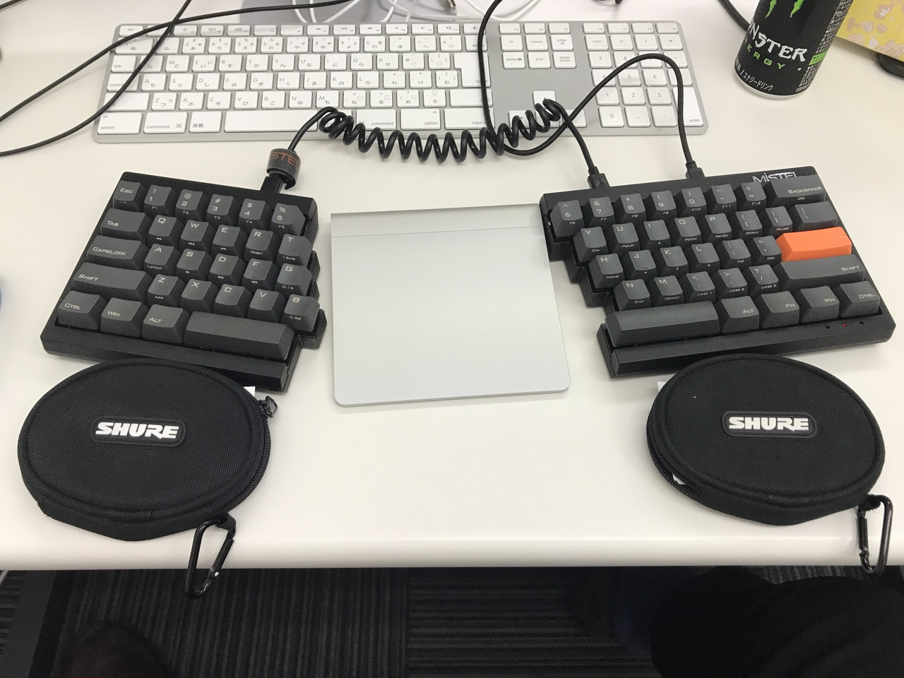
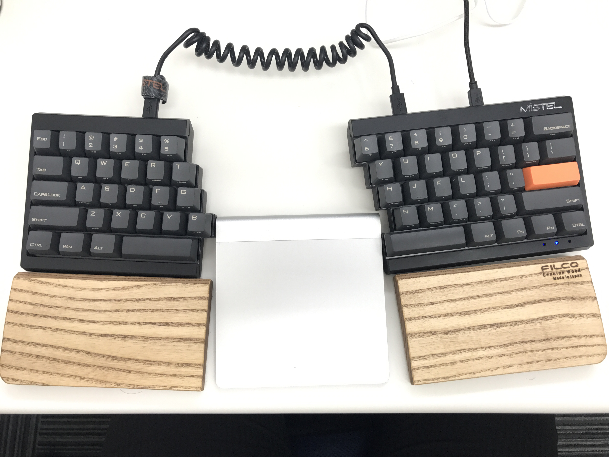

こんにちは！きりんさんです！

先日、左右に分離する変態メカニカルキーボードキーボード、Mistel Barocco MD600を買うまでを記事にしました。

今回は、届いてから使用してどうだったのかを書いていきます！

主にキーボード配置に苦労した話なので、キーボード自体のカスタマイズの話は次回の記事を読んでください。



### Mistel Barocco MD600の関連記事

  * [変態キーボード、Mistel Barocco MD600 を買った話][1]
  * [変態キーボード Mistel Barocco MD600 の配置に苦戦した話][2]
  * [変態キーボード Mistel Barocco MD600 のキーをカスタマイズした話][3]

## この記事のまとめ

  * 分離式は正義。肩こりで悩んでるなら即買いすべし。
  * パームレストがあると更に幸せになれる。
  * 付属のカールケーブルが使いづらいので、お湯で伸ばすか別のケーブル推奨

<!--more-->

## 届いた

Amazonさんは翌日の夜に届けてくれました！さすが！

### さっそく開封

なんか、キーボードが届いた割に**箱が四角い**。

中を空けると分割した状態で梱包されてる模様。こんなキーボード初めてで、テンションが上がる。

付属品は、

  * **キーボードが左右**
  * キーボード同士をつなげるmicroUSBのカールケーブル
  * キーボードとPCをつなげるUSBケーブル
  * 交換用のEnterキー
  * キー交換用の工具
  * 滑り止め

### 軸の確認

ダサいかもしれないけどUS配列のEnterに慣れる自信が無かったのと、茶軸を確認したかったのでキーを交換することに。

おっ！**しっかり茶軸！**

大きいキーには補助の軸がついてますね。

## 使ってみる

### 自宅のMac Book Proで配置テスト

キートップを交換したので、Mac Book Proで試すことにしました。

が、MacBookProの左右に配置する段階で**カールケーブルがめちゃカールする**問題が発生しました。

**問題ないように見える**のですが、最初は直線においていたキーボードが、無理やりハの字に動いていきます。

打てないことはないですが、どんどん肘が開いていき、とても快適なタイピングとは言えないので、MBPを**野菜1日これ1本の段ボール**に乗せたのがこちら

マシになりました。でも、パームレスト置く場所ないな……

時間が無くて会社へ移動したのですが、家で使うなら、ノートPC台が必要になりそうです。

### 会社で使う

さて、会社で投入してみました。会社はiMacなので、PCの位置は問題なしです。

パームレストがまだ届いて無いので、**Shure SE215のケースに名刺を詰めてパームレストにしている**のですが、やっぱりちょっと打ちにくい。

さらに、相変わらず**カールケーブルが頑張っている**せいでMagic Trackpadを挟んだだけで自動的にハの字に……。

やむをえず**microUSB同士のケーブル**を注文しましたが中国発送で1週間以上かかる模様。

どうしたものか。

### 答えは熱

翌日、FILCOのパームレストが届きました。イヤホンケースのパームレストでの不満がすべて解消され、正直この**FILCOパームレストとセットじゃないとおすすめできないくらい快適**！ありがとうFILCO！さようならSE 215のケース！

しかし、問題はカールケーブル。

間にMagic Track Padを挟むとハの字になります。

なんとかならんかんぁ〜とキーボードの間にコーヒーを置いて考えていると、ふとアイディアが。

**ケーブルにお湯をかければいいのでは！？**

カールしてないケーブルをすでに注文してるので、現状の使えないケーブルなら断線しても怖くない。ということで、給湯室でお湯をかけることに。

1回熱湯をかけ、水で冷やすと、見事に3〜5cmほどカールがゆるくなりました。

1回では少したりなかったので、2回お湯をかると、見事にちょうどいいカール具合！

特に断線もせず、いい感じに伸びています！

## 最高の叩き心地

キー設定に関しては次回の記事で書きますが、パームレストとカールケーブルを伸ばしたことで、Barocco MD600は**最高のキーボード**になりました。仕事終わりの**肩こりが4分の1**くらいに。さらに叩きたくなるメカニカル感。ほんと最高です。ありがとうMistel！ありがとうCheryMX！

あとは次回の記事でキー配置を解説したらBarocco MD600のレビューはおしまいです。

ここまでお読みいただいきありがとうございます！あと1記事だけおつきあいください！

## まとめ

お湯でカールケーブルを伸ばすなら、**自己責任**で！では、また次回！

<iframe style="width:120px;height:240px;" marginwidth="0" marginheight="0" scrolling="no" frameborder="0" src="//rcm-fe.amazon-adsystem.com/e/cm?lt1=_blank&bc1=000000&IS2=1&bg1=FFFFFF&fc1=000000&lc1=0000FF&t=musikirin07-22&language=ja_JP&o=9&p=8&l=as4&m=amazon&f=ifr&ref=as_ss_li_til&asins=B01KN6LBDU&linkId=9dfd4e3cb161e63f214b5fb80273077f"></iframe>

 [1]: http://musikirin.com/archives/2017/10/mistel-barocco-md600
 [2]: http://musikirin.com/archives/2017/10/mistel-barocco-md600-2
 [3]: http://musikirin.com/archives/2017/10/mistel-barocco-md600-3