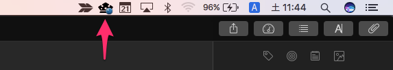
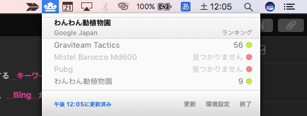
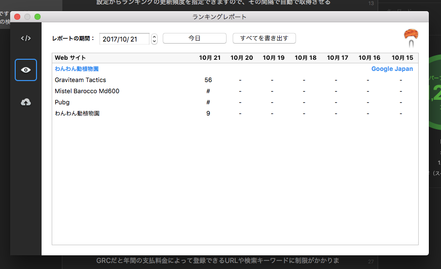

こんにちはー！きりんさんです！

仕事柄、よくWebサイトやホームページの検索順位を監視するのですが、**毎回手動で検索するのが結構めんどくさくて困っていました。**

Windowsだと**GRC**というツールが有名で、高機能で年5,000円ほどで使えるんですが、MacだとなかなかGRCに相当するツールがありません。

何かしらのスクリプトを書くか迷っていたところ、**Mac専用**の**1,000円以内で買いきれる検索順位監視ツール**を見つけたのでご紹介します。

<!-- more -->



  

    <a href="https://itunes.apple.c../app/rankguru-seo/id662946309?mt=12&uo=4&partnerId=11&at=1000lHzU" target="itune_store">
  

  
  

    

      <a href="https://itunes.apple.c../app/rankguru-seo/id662946309?mt=12&uo=4&partnerId=11&at=1000lHzU" target="itune_store">RankGuru SEO</a>
    

    
    

      ビジネス, 開発ツール¥840
    

    
    

      <a class="wpal-btn" href="https://itunes.apple.c../app/rankguru-seo/id662946309?mt=12&uo=4&partnerId=11&at=1000lHzU" target="itune_store">Mac App Store</a>
    

  

<!-- Cache-->

## 3点まとめ

  * 840円で買えるので、なんとなく順位が気になるなら便利
  * グラフ表示機能はないけどCSVで出力可能
  * 起動中しか順位を取得できないのでPC放置気味な人は注意

<!--more-->

## RankGuru SEO

App Storeで840円にて販売されています。

機能は非常に簡単で、**URLを入力**して、それに対する**キーワード**と、**どの検索エンジンを利用するか**（**Google**、**Yahoo**、**Bing**から選択可能）を選び、**放置するだけ**です。

設定からランキングの更新頻度を指定できますので、その間隔で自動で取得させるか、もしくは手動でランキングを取得させることができます。

## できること

### ツールバー常駐

画面右上に常駐して、クリックをすれば現時点の順位を表示してくれます。

上記のように

検索キーワード左の数字と色で現在の順位と、前回の順位からの変動を確認できます。

緑色→順位上昇、灰色→順位維持、赤色→順位下降といった感じです。

サイト名ですら1位になってないことがよくわかります！

### 履歴の表示

環境設定から、今まで取得した順位を見られます。

グラフ表示はされませんが、CSVを出力できるので、ExcelかNumbersでグラフ化できます。

### 登録数が無制限

GRCだと年間の支払料金によって登録できるURLや検索キーワードに制限がかかりますが、RankGuru SEOはURLにも検索キーワードにも登録制限がありません！とりあえず手持ちのサイトを全部登録できるのはありがたいですね。

## 気づいたこと

同じキーワードでも検索エンジンが異なると項目が増えていく（Google、Yahoo、Bingで登録すると3つの項目になる）ので、キーワード数が多いと、順位リストが見づらくなっていきます。

**GoogleとYahooは検索アルゴリズムが同じ**で、順位差が少ないので、重要なサイトを除いては**Google、Bingのみの登録で良い**と思います。

## 気になること、できないこと

  * 順位のグラフ表示はできない
  * Macを立ち上げているときに取得するので、**職場の作業用Macの場合、土日祝は取得できない**
  * Googleの場合、件数が多いとロボット認証をさせられることがある
  * アイコンが脳みそに見えた（多分ターバン）

## まとめ

右上に常駐してくれるので、時間が無いときでも**毎日順位を見られる**し、順位が下がっている場合は赤色のマーカーがつくため便利です。本格的な分析には向きませんが、職場でこっそり使うには丁度よいツールでした！

Macを使っていて、**毎回シークレットモードを開いて順位を検索するのが面倒な人**におすすめです！

  

    <a href="https://itunes.apple.c../app/rankguru-seo/id662946309?mt=12&uo=4&partnerId=11&at=1000lHzU" target="itune_store">
  

  
  

    

      <a href="https://itunes.apple.c../app/rankguru-seo/id662946309?mt=12&uo=4&partnerId=11&at=1000lHzU" target="itune_store">RankGuru SEO</a>
    

    
    

      ビジネス, 開発ツール¥840
    

    
    

      <a class="wpal-btn" href="https://itunes.apple.c../app/rankguru-seo/id662946309?mt=12&uo=4&partnerId=11&at=1000lHzU" target="itune_store">Mac App Store</a>
    

  
<figure class="wpal-screenshots"><figcaption>Screenshots</figcaption>
  
  

<!-- Cache-->