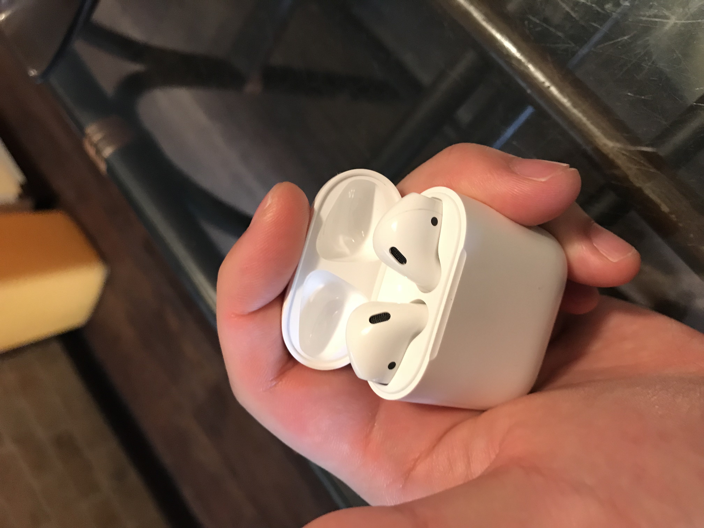
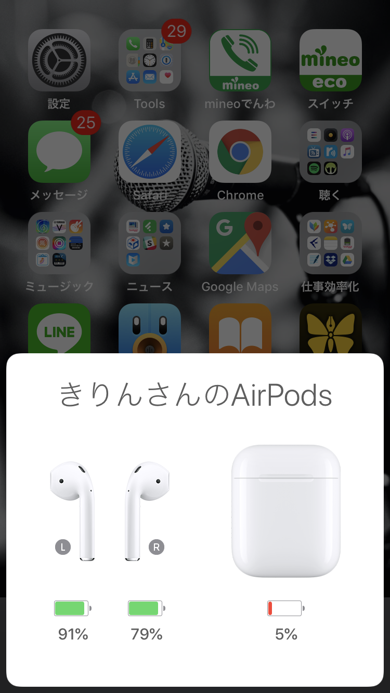
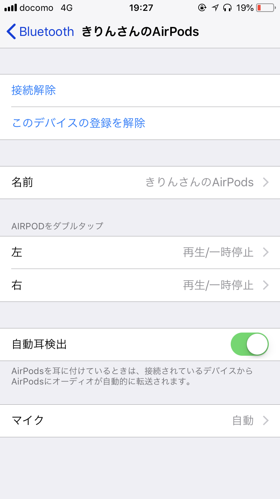

お久しぶりです。

最近、完全分離型のワイヤレスイヤホンが欲しくなり、最終的にAppleの**AirPods**を買ったのでレビューします。

<iframe style="width:120px;height:240px;" marginwidth="0" marginheight="0" scrolling="no" frameborder="0" src="//rcm-fe.amazon-adsystem.com/e/cm?lt1=_blank&bc1=000000&IS2=1&bg1=FFFFFF&fc1=000000&lc1=0000FF&t=musikirin07-22&language=ja_JP&o=9&p=8&l=as4&m=amazon&f=ifr&ref=as_ss_li_til&asins=B01N2VMGT6&linkId=6f1a162d2ae776a72d957c262d6616f4"></iframe>

<!--more-->

## なぜAirPodsにしたか

音質よりも**快適なワイヤレス環境を体験したかったから**です。

### 比較条件

完全分離型のワイヤレスイヤホンを選ぶにあたってこだわったのは次の内容です。

  * 電池が持つこと。仕事中と通勤で使うので4時間くらい持って欲しい。
  * 外部の音がある程度聞こえること。話しかけられたときに反応できる程度。
  * 音漏れしにくいこと。
  * 充電が面倒くさくないこと。
  * 2万円以内。

この条件で探した結果、最初は**Anker Zolo Liverty+**が第一候補に上がっていました。

<noscript>
  <iframe src="http://rcm-jp.amazon.co.jp/e/cm?t=musikirin07-22&o=9&p=8&l=as1&asins=B075SS3QH1&fc1=000000&IS2=1&lt1=_blank&m=amazon&lc1=0000FF&bc1=000000&bg1=FFFFFF&f=ifr" style="width:120px;height:240px;" scrolling="no" marginwidth="0" marginheight="0" frameborder="0"></iframe>
</noscript>

**Zolo Liberty+**は、2017年末発売の新作で、カナル式の完全密閉ながら、**外部音の取り込み機能**があります。

特に仕事中に使いたかったので、_集中したい時はシャットアウト_して、_話しかけられそうな時は外部音取り込み機能_を使えるのは大変魅力的です。

もし**Android**だったら、**Zolo Liberty +**にしていたと思います。

### でもAirPodsにした

それでも、**AirPods**にしました。

それは次の理由からです。

  * Zolo Liberty+は**連続使用3.5時間**。AirPodsは**連続使用5時間**で、**片耳ずつ使用できる**こと。
  * 「Zolo Liberty+は_ケースから取り出しにくい_」というレビューがいくつかあったこと。
  * AirPodsはW1チップが入ってるので、_iPhoneでの使用感が最高_らしいこと。
  * iPhoneの場合は、AirPodsの方が遅延が少ないらしいこと。
  * ふつうのインナーイヤーよりはEarPodsやAirPodsの形状の方が音漏れしにくいこと。

完全ワイヤレスイヤホンは、用途を考えると**快適性が命**な感じがしたので、「iPhoneを使っているのであれば、Appleが作ったAirPodsから使ってみるのが筋だろう」ということでAirPodsを選びました。

### 余談 &#8211; 購入が案外面倒だった

買うことが決まったので、早速Appleのオンラインストアから注文し、当日実店舗へ取りに行きました。

GW中なこともあり混雑していたのか、

  * 店員を捕まえるのに数分
  * 商品を持ってくるのに数分
  * 本人確認、署名や商品確認で数分

と、受け取りだけなのに20分弱かかったので、_ネットで買わなくてもその場で買えばよかったのでは…_という感じでした。ちょっと残念。

## 使い勝手

使い勝手は**噂通り最高**です。

箱を開けての感想は、**けっこうケースが小さい**。

胸ポケットやズボン、パンツのポケットに入れても**邪魔になりません**。

完全ワイヤレス型は、ケースに仕舞わないと充電されないため、**常に持ち歩けるケース**は高評価です。小さすぎて鞄にしまうと見失うことがあります。

そして、_AirPodsのケースを開くだけで手元のiPhoneとペアリングされました_。**すごい……！**

ペアリング後も、iPhoneを使ってる時にケースを開けば、**それぞれの充電状況**を教えてくれます。

耳にセットすれば**接続音**が鳴り、再生デバイスがAirPodsに切り替わります。

片耳を外せば音楽は止まり、戻せば引き続き再生されます。

当たり前の挙動ですが、**不自由しないのが嬉しい**。

また、デフォルトでは**イヤホン装着中**に**ダブルタップ**でSiriが呼び出されますが、設定からコマンドの変更が可能です。

私は、**再生/一時停止**に割り当てています。

さらに**マイクは両側**にあり、左右のイヤホンどちら側でも**片方で通話可能**です。

再生の遅延ですが、_動画を見てても気にならないくらい遅延が少ない_です。スマホでシビアなゲームをするなら厳しいかもしれません。

とにかく、AirPodsの使用感は**最高**でした。

## 満足度

では、完璧か。というと、少し惜しい部分がありました。

  * 腕を上げて伸びをした時に**イヤホンが吹っ飛んだ**。
  * 電車だとポッドキャストなどの音声系メディアが聞こえづらい。
  * 耳うどん。
  * 高音持ち上げ気味でかなりシャリシャリ。

一般的なインナーイヤーよりは耳にしっかりフィットしますが、流石に_激しい動きをすると外れます_。

また、カナル式でないので_周りが煩いと音が聞こえません_。

あとは**見た目**。

これは_着脱やケースの出し入れが楽_なので、一長一短ですが、白以外のバリエーションがあれば解決されるかもしれませんね。

音質は**相当シャリシャリ**です。低ビットレートの音楽を聴くと、ハイハットにビットクラッシャーをかけたんじゃないかってくらいシャリシャリします。&#x1f363;寿司かよ。

しかしながら、おかげさまで電車の中でもポッドキャストが聴けます。

iPhone+インナーイヤー+Bluetoothの時点で音質は諦めてるので、むしろこれでちょうど良いです。

## まとめ

普段から**iPhone**で**1万円以内のインナーイヤーイヤホン**を使っていて、**音質重視じゃない**なら**買い**です。

でも、**WWDC**で**AirPods2**が出るという噂もありますので、様子を見るのもアリかも？

音質を求めるならポータブルアンプ買った方がいいと思います。

以上。AirPodsのレビューでした。

<iframe style="width:120px;height:240px;" marginwidth="0" marginheight="0" scrolling="no" frameborder="0" src="//rcm-fe.amazon-adsystem.com/e/cm?lt1=_blank&bc1=000000&IS2=1&bg1=FFFFFF&fc1=000000&lc1=0000FF&t=musikirin07-22&language=ja_JP&o=9&p=8&l=as4&m=amazon&f=ifr&ref=as_ss_li_til&asins=B01N2VMGT6&linkId=6f1a162d2ae776a72d957c262d6616f4"></iframe>