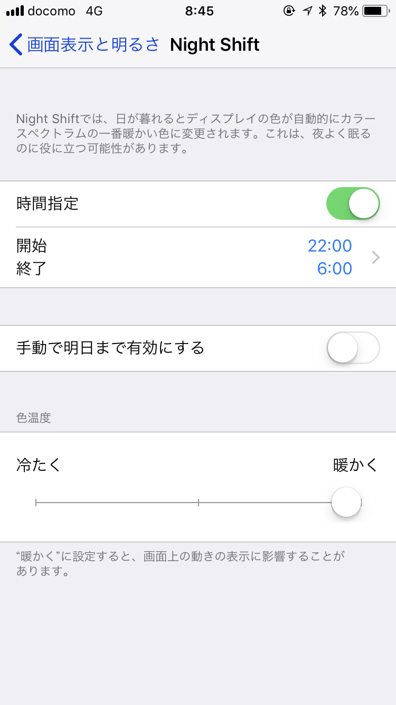
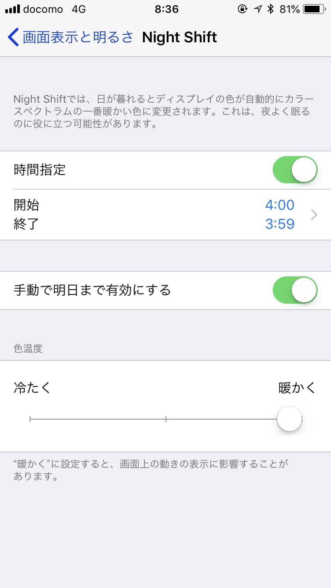
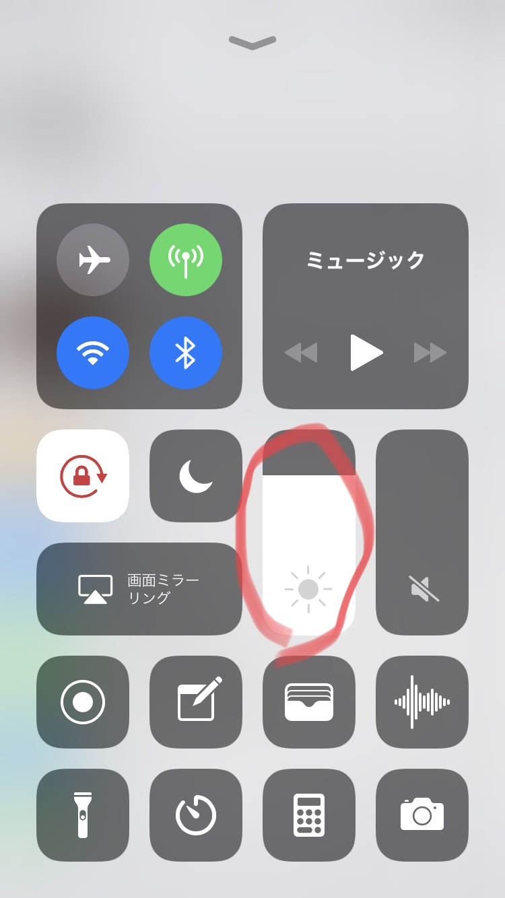
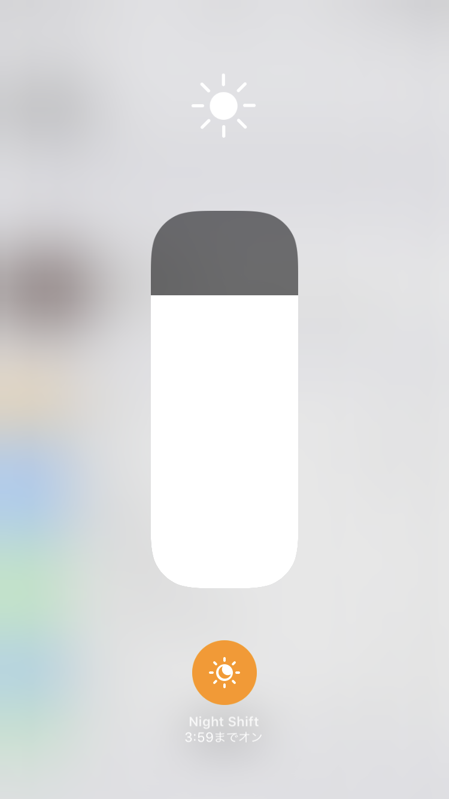

職場含めあらゆる場所で「**なんで画面黄色いの？**」って言われます。いわゆる**ブルーライトカット**というやつです。

<!--more-->



私は、他人に比べて目からの頭痛になりやすく(多分、眼球振盪と乱視と斜視が原因)、閾値を超えると激しい吐き気に襲われるので自己防衛として**真黄色**な画面で過ごしています。なんなら、iPhoneはNightShiftが搭載されるまで、**画面を黄色にするためだけ**に**JailBreak**してました。

もちろんMac、Windowsは**f.lux**常用。色確認する時を除いて、あらゆるディスプレイが黄色です。

## NightShift

**f.lux**は常時オンできるのですが、iPhone搭載の**NightShift**は常時オンにできません。

なんか時間指定させられます。

### 23時間59分オンにしとく

話は単純です。こうします。

4:00開始、3:59終了にします。

寝てる間、**1分だけピカーッと青くなります**が、朝起きたらNightShiftが始まります。

これで起きてる間は常にNightShiftがオンになりました。単純ですね。

## おまけ: コントロールセンターからNightShift操作

写真の色合いを見る時に、NightShiftをオフにしたいことがあります。

そんな時は、コントロールセンターを開いて、

明るさ調整のエリアを3Dタッチ。強く押し込みます。

そうすると、**明るさ調整だけ**の画面に切り替わり、**NightShiftのオンオフボタン**が出現します。

これでNightShiftを常時オンにしても困ることはないと思います。

目を守りましょう！

以上！